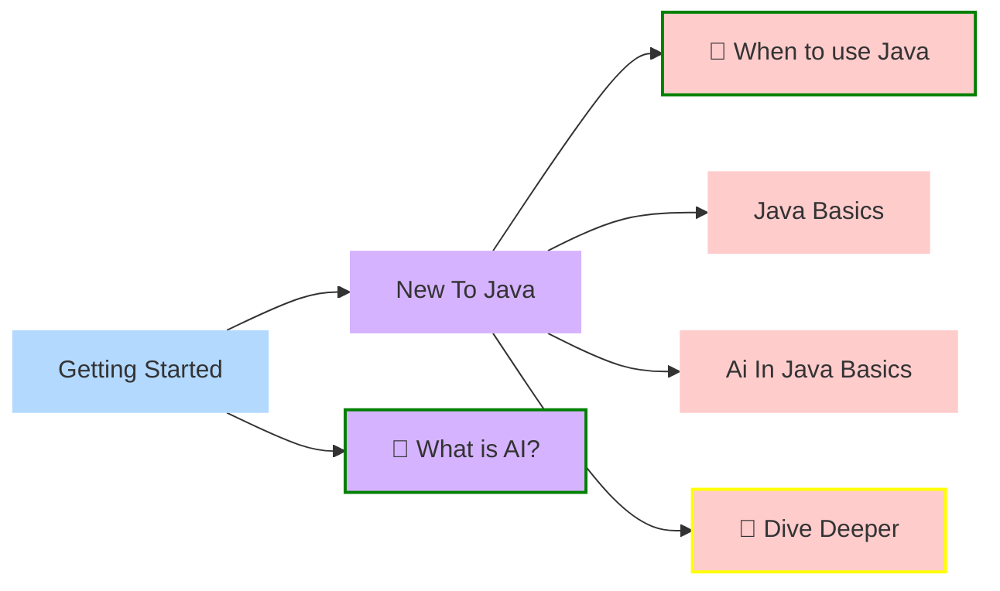

## Welcome to this resource on Java and AI!

Wether you're new to AI, new to Java, seasoned in both, or looking for classroom materials, here you'll find your joy.

This site has short intros and clickable flatmaps to help you get where you need to get, as fast as possible.

Do you want to contribute yourself, or know about an interesting resource to link here? Have a look at our contribution guideline (we made it as easy as possible, promised!).
## What's in this chapter?
### Getting Started

<em>Click any block below to navigate directly to that section.</em>

<small><strong>Legend:</strong> **💻** type:code | **🙌** type:tutorial | **📊** type:benchmark | **📚** type:api-doc | **🧭** type:overview | **🔗** type:external | **border:🟢** level:beginner | **border:🟡** level:intermediate | **border:🟠** level:advanced | **border:🔴** level:expert | **bg:⬤** status:draft | **bg:⬤** status:wip | **bg:⬤** status:review-needed | **bg:⬤** status:planned | **•** visibility:internal | **•** visibility:archived</small>