## Welcome to this resource on Java and AI!

Wether you're new to AI, new to Java, seasoned in both, or looking for classroom materials, here you'll find your joy.

This site has short intros and clickable flatmaps to help you get where you need to get, as fast as possible.

Do you want to contribute yourself, or know about an interesting resource to link here? Have a look at our contribution guideline (we made it as easy as possible, promised!).
## What's in this chapter?
### Getting Started

```mermaid
graph LR
n_00_getting_started["Getting Started"]
n_00_getting_started_05_new_to_java["New To Java"]
n_00_getting_started --> n_00_getting_started_05_new_to_java
n_00_getting_started_05_new_to_java_40_when_java_md["🙌 When to use Java"]
n_00_getting_started_05_new_to_java --> n_00_getting_started_05_new_to_java_40_when_java_md
n_00_getting_started_05_new_to_java_10_java_basics["Java Basics"]
n_00_getting_started_05_new_to_java --> n_00_getting_started_05_new_to_java_10_java_basics
n_00_getting_started_05_new_to_java_20_ai_in_java_basics["Ai In Java Basics"]
n_00_getting_started_05_new_to_java --> n_00_getting_started_05_new_to_java_20_ai_in_java_basics
n_00_getting_started_05_new_to_java_30_dive_deeper_md["🧭 Dive Deeper"]
n_00_getting_started_05_new_to_java --> n_00_getting_started_05_new_to_java_30_dive_deeper_md
n_00_getting_started_what_is_ai_md["🧭 What is AI?"]
n_00_getting_started --> n_00_getting_started_what_is_ai_md
click n_00_getting_started "/docs/getting-started"
click n_00_getting_started_05_new_to_java "/docs/getting-started/new-to-java"
click n_00_getting_started_05_new_to_java_40_when_java_md "/docs/getting-started/new-to-java/when-java"
click n_00_getting_started_05_new_to_java_10_java_basics "/docs/getting-started/new-to-java/java-basics"
click n_00_getting_started_05_new_to_java_20_ai_in_java_basics "/docs/getting-started/new-to-java/ai-in-java-basics"
click n_00_getting_started_05_new_to_java_30_dive_deeper_md "/docs/getting-started/new-to-java/dive-deeper"
click n_00_getting_started_what_is_ai_md "/docs/getting-started/what-is-ai"
classDef col0 fill:#b3d9ff,stroke:none;
classDef col1 fill:#d5b3ff,stroke:none;
classDef col2 fill:#ffcccc,stroke:none;
class n_00_getting_started_05_new_to_java_10_java_basics col2;
class n_00_getting_started_05_new_to_java_20_ai_in_java_basics col2;
class n_00_getting_started_05_new_to_java col1;
class n_00_getting_started col0;
classDef custom0 fill:#ffcccc,stroke:green,stroke-width:2px,stroke-dasharray:0;
class n_00_getting_started_05_new_to_java_40_when_java_md custom0;
classDef custom1 fill:#ffcccc,stroke:yellow,stroke-width:2px,stroke-dasharray:0;
class n_00_getting_started_05_new_to_java_30_dive_deeper_md custom1;
classDef custom2 fill:#d5b3ff,stroke:green,stroke-width:2px,stroke-dasharray:0;
class n_00_getting_started_what_is_ai_md custom2;
linkStyle default interpolate basis
```

<em>Click any block below to navigate directly to that section.</em>

<small><strong>Legend:</strong> **💻** type:code | **🙌** type:tutorial | **📊** type:benchmark | **📚** type:api-doc | **🧭** type:overview | **🔗** type:external | **border:🟢** level:beginner | **border:🟡** level:intermediate | **border:🟠** level:advanced | **border:🔴** level:expert | **bg:⬤** status:draft | **bg:⬤** status:wip | **bg:⬤** status:review-needed | **bg:⬤** status:planned | **•** visibility:internal | **•** visibility:archived</small>