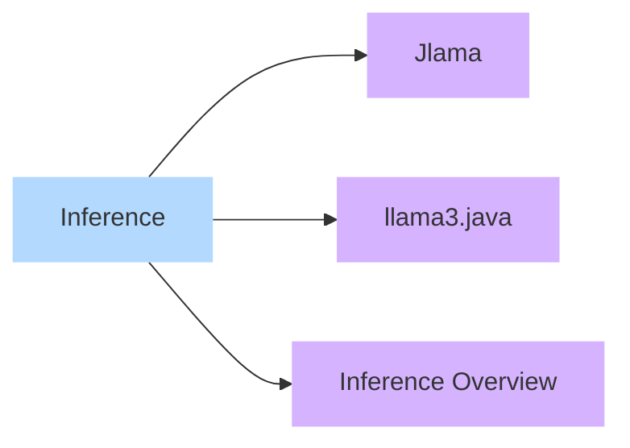

<!-- AUTO-GENERATED FILE — DO NOT EDIT. Regenerated on merge -->

### Inference

<em>Click any block below to navigate directly to that section.</em>

```mermaid
graph LR
n_10_foundations_inference["Inference"]
n_10_foundations_inference_jlama_md["Jlama"]
n_10_foundations_inference --> n_10_foundations_inference_jlama_md
n_10_foundations_inference_llama3_java_md["llama3.java"]
n_10_foundations_inference --> n_10_foundations_inference_llama3_java_md
n_10_foundations_inference_overview_md["Inference Overview"]
n_10_foundations_inference --> n_10_foundations_inference_overview_md
click n_10_foundations_inference "/docs/foundations/inference"
click n_10_foundations_inference_jlama_md "/docs/foundations/inference/jlama"
click n_10_foundations_inference_llama3_java_md "/docs/foundations/inference/llama3-java"
click n_10_foundations_inference_overview_md "/docs/foundations/inference/overview"
classDef col0 fill:#b3d9ff,stroke:none;
classDef col1 fill:#d5b3ff,stroke:none;
classDef col2 fill:#ffcccc,stroke:none;
classDef col3 fill:#ffd699,stroke:none;
classDef col4 fill:#d0f0c0,stroke:none;
class n_10_foundations_inference_jlama_md col1;
class n_10_foundations_inference_llama3_java_md col1;
class n_10_foundations_inference_overview_md col1;
class n_10_foundations_inference col0;
linkStyle default interpolate basis
```