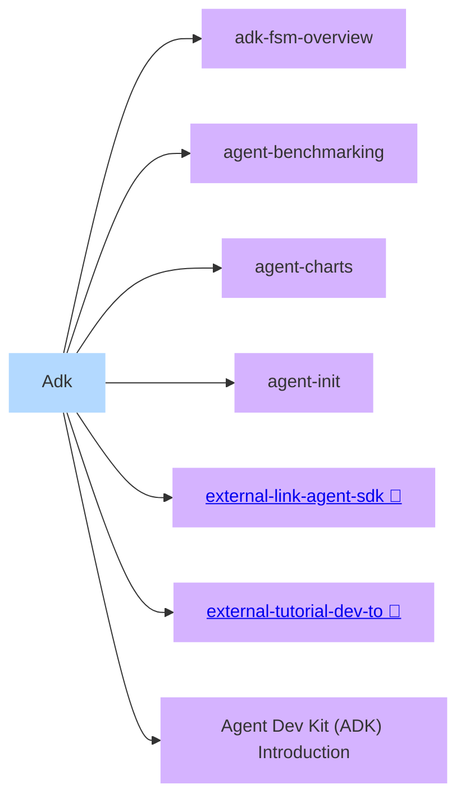

<!-- AUTO-GENERATED FILE — DO NOT EDIT. Regenerated on merge -->

### Adk

<em>Click any block below to navigate directly to that section.</em>

```mermaid
graph LR
n_20_agent_frameworks_adk["Adk"]
n_20_agent_frameworks_adk_adk_fsm_overview_md["adk-fsm-overview"]
n_20_agent_frameworks_adk --> n_20_agent_frameworks_adk_adk_fsm_overview_md
n_20_agent_frameworks_adk_agent_benchmarking_md["agent-benchmarking"]
n_20_agent_frameworks_adk --> n_20_agent_frameworks_adk_agent_benchmarking_md
n_20_agent_frameworks_adk_agent_charts_md["agent-charts"]
n_20_agent_frameworks_adk --> n_20_agent_frameworks_adk_agent_charts_md
n_20_agent_frameworks_adk_agent_init_md["agent-init"]
n_20_agent_frameworks_adk --> n_20_agent_frameworks_adk_agent_init_md
n_20_agent_frameworks_adk_external_link_agent_sdk_md["<a href='https://google.github.io/adk-docs/' target='_blank' rel='noopener noreferrer'>external-link-agent-sdk 🔗</a>"]
n_20_agent_frameworks_adk --> n_20_agent_frameworks_adk_external_link_agent_sdk_md
n_20_agent_frameworks_adk_external_tutorial_dev_to_md["<a href='https://www.datacamp.com/tutorial/agent-development-kit-adk' target='_blank' rel='noopener noreferrer'>external-tutorial-dev-to 🔗</a>"]
n_20_agent_frameworks_adk --> n_20_agent_frameworks_adk_external_tutorial_dev_to_md
n_20_agent_frameworks_adk_intro_md["Agent Dev Kit (ADK) Introduction"]
n_20_agent_frameworks_adk --> n_20_agent_frameworks_adk_intro_md
click n_20_agent_frameworks_adk "/docs/agent-frameworks/adk"
click n_20_agent_frameworks_adk_adk_fsm_overview_md "/docs/agent-frameworks/adk/adk-fsm-overview"
click n_20_agent_frameworks_adk_agent_benchmarking_md "/docs/agent-frameworks/adk/agent-benchmarking"
click n_20_agent_frameworks_adk_agent_charts_md "/docs/agent-frameworks/adk/agent-charts"
click n_20_agent_frameworks_adk_agent_init_md "/docs/agent-frameworks/adk/agent-init"
click n_20_agent_frameworks_adk_intro_md "/docs/agent-frameworks/adk/intro"
classDef col0 fill:#b3d9ff,stroke:none;
classDef col1 fill:#d5b3ff,stroke:none;
classDef col2 fill:#ffcccc,stroke:none;
classDef col3 fill:#ffd699,stroke:none;
classDef col4 fill:#d0f0c0,stroke:none;
class n_20_agent_frameworks_adk_adk_fsm_overview_md col1;
class n_20_agent_frameworks_adk_agent_benchmarking_md col1;
class n_20_agent_frameworks_adk_agent_charts_md col1;
class n_20_agent_frameworks_adk_agent_init_md col1;
class n_20_agent_frameworks_adk_external_link_agent_sdk_md col1;
class n_20_agent_frameworks_adk_external_tutorial_dev_to_md col1;
class n_20_agent_frameworks_adk_intro_md col1;
class n_20_agent_frameworks_adk col0;
linkStyle default interpolate basis
```