<!-- AUTO-GENERATED FILE — DO NOT EDIT. Regenerated on merge -->

### Agent Frameworks

```mermaid
graph LR
n_20_agent_frameworks["Agent Frameworks"]
n_20_agent_frameworks_adk["Adk"]
n_20_agent_frameworks --> n_20_agent_frameworks_adk
n_20_agent_frameworks_adk_adk_fsm_overview_md["adk-fsm-overview"]
n_20_agent_frameworks_adk --> n_20_agent_frameworks_adk_adk_fsm_overview_md
n_20_agent_frameworks_adk_agent_benchmarking_md["agent-benchmarking"]
n_20_agent_frameworks_adk --> n_20_agent_frameworks_adk_agent_benchmarking_md
n_20_agent_frameworks_adk_agent_charts_md["🙌 agent-charts"]
n_20_agent_frameworks_adk --> n_20_agent_frameworks_adk_agent_charts_md
n_20_agent_frameworks_adk_agent_init_md["agent-init"]
n_20_agent_frameworks_adk --> n_20_agent_frameworks_adk_agent_init_md
n_20_agent_frameworks_adk_external_link_agent_sdk_md["<a href='https://google.github.io/adk-docs/' target='_blank' rel='noopener noreferrer'>external-link-agent-sdk 🔗</a>"]
n_20_agent_frameworks_adk --> n_20_agent_frameworks_adk_external_link_agent_sdk_md
n_20_agent_frameworks_adk_external_tutorial_dev_to_md["<a href='https://www.datacamp.com/tutorial/agent-development-kit-adk' target='_blank' rel='noopener noreferrer'>external-tutorial-dev-to 🔗</a>"]
n_20_agent_frameworks_adk --> n_20_agent_frameworks_adk_external_tutorial_dev_to_md
n_20_agent_frameworks_adk_intro_md["intro"]
n_20_agent_frameworks_adk --> n_20_agent_frameworks_adk_intro_md
n_20_agent_frameworks_langchain4j["Langchain4J"]
n_20_agent_frameworks --> n_20_agent_frameworks_langchain4j
n_20_agent_frameworks_langgraph4j["Langgraph4J"]
n_20_agent_frameworks --> n_20_agent_frameworks_langgraph4j
n_20_agent_frameworks_langgraph4j_status_todo_md["TODO: LangGraph4j by @vorburger"]
n_20_agent_frameworks_langgraph4j --> n_20_agent_frameworks_langgraph4j_status_todo_md
n_20_agent_frameworks_overview_md["Agent Frameworks Overview"]
n_20_agent_frameworks --> n_20_agent_frameworks_overview_md
click n_20_agent_frameworks "/docs/agent-frameworks"
click n_20_agent_frameworks_adk "/docs/agent-frameworks/adk"
click n_20_agent_frameworks_adk_adk_fsm_overview_md "/docs/agent-frameworks/adk/adk-fsm-overview"
click n_20_agent_frameworks_adk_agent_benchmarking_md "/docs/agent-frameworks/adk/agent-benchmarking"
click n_20_agent_frameworks_adk_agent_charts_md "/docs/agent-frameworks/adk/agent-charts"
click n_20_agent_frameworks_adk_agent_init_md "/docs/agent-frameworks/adk/agent-init"
click n_20_agent_frameworks_adk_intro_md "/docs/agent-frameworks/adk/intro"
click n_20_agent_frameworks_langchain4j "/docs/agent-frameworks/langchain4j"
click n_20_agent_frameworks_langgraph4j "/docs/agent-frameworks/langgraph4j"
click n_20_agent_frameworks_langgraph4j_status_todo_md "/docs/agent-frameworks/langgraph4j/status-todo"
click n_20_agent_frameworks_overview_md "/docs/agent-frameworks/overview"
classDef col0 fill:#b3d9ff,stroke:none;
classDef col1 fill:#d5b3ff,stroke:none;
classDef col2 fill:#ffcccc,stroke:none;
classDef col3 fill:#ffd699,stroke:none;
classDef col4 fill:#d0f0c0,stroke:none;
class n_20_agent_frameworks_adk_external_link_agent_sdk_md col2;
class n_20_agent_frameworks_adk_intro_md col2;
class n_20_agent_frameworks_adk col1;
class n_20_agent_frameworks_langchain4j col1;
class n_20_agent_frameworks_langgraph4j_status_todo_md col2;
class n_20_agent_frameworks_langgraph4j col1;
class n_20_agent_frameworks_overview_md col1;
class n_20_agent_frameworks col0;
classDef custom0 stroke:yellow,stroke-width:2px,stroke-dasharray:0;
class n_20_agent_frameworks_adk_adk_fsm_overview_md custom0;
classDef custom1 fill:lightgrey,stroke:orange,stroke-width:2px,stroke-dasharray:0;
class n_20_agent_frameworks_adk_agent_benchmarking_md custom1;
classDef custom2 stroke:yellow,stroke-width:2px,stroke-dasharray:0;
class n_20_agent_frameworks_adk_agent_charts_md custom2;
classDef custom3 stroke:green,stroke-width:2px,stroke-dasharray:0;
class n_20_agent_frameworks_adk_agent_init_md custom3;
classDef custom4 stroke:green,stroke-width:2px,stroke-dasharray:0;
class n_20_agent_frameworks_adk_external_tutorial_dev_to_md custom4;
linkStyle default interpolate basis
```

<em>Click any block below to navigate directly to that section.</em>

<small><strong>Legend:</strong> **💻** type:code | **🙌** type:tutorial | **📊** type:benchmark | **📚** type:api-doc | **🧭** type:overview | **border:🟢** level:beginner | **border:🟡** level:intermediate | **border:🟠** level:advanced | **border:🔴** level:expert | **bg:⬤** status:draft | **bg:⬤** status:wip | **bg:⬤** status:review-needed | **bg:⬤** status:planned | **•** visibility:internal | **•** visibility:archived</small>