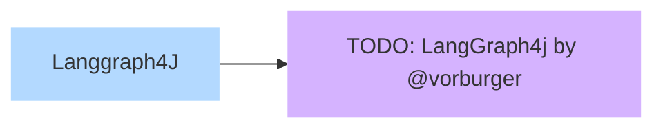

<!-- AUTO-GENERATED FILE — DO NOT EDIT. Regenerated on merge -->

### Langgraph4J

<em>Click any block below to navigate directly to that section.</em>

```mermaid
graph LR
n_20_agent_frameworks_langgraph4j["Langgraph4J"]
n_20_agent_frameworks_langgraph4j_status_todo_md["TODO: LangGraph4j by @vorburger"]
n_20_agent_frameworks_langgraph4j --> n_20_agent_frameworks_langgraph4j_status_todo_md
click n_20_agent_frameworks_langgraph4j "/docs/agent-frameworks/langgraph4j"
click n_20_agent_frameworks_langgraph4j_status_todo_md "/docs/agent-frameworks/langgraph4j/status-todo"
classDef col0 fill:#b3d9ff,stroke:none;
classDef col1 fill:#d5b3ff,stroke:none;
classDef col2 fill:#ffcccc,stroke:none;
classDef col3 fill:#ffd699,stroke:none;
classDef col4 fill:#d0f0c0,stroke:none;
class n_20_agent_frameworks_langgraph4j_status_todo_md col1;
class n_20_agent_frameworks_langgraph4j col0;
linkStyle default interpolate basis
```