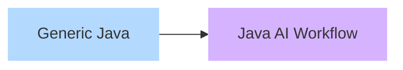

<!-- AUTO-GENERATED FILE — DO NOT EDIT. Regenerated on merge -->

### Generic Java

<em>Click any block below to navigate directly to that section.</em>

<small><strong>Legend:</strong> **💻** type:code | **🙌** type:tutorial | **📊** type:benchmark | **📚** type:api-doc | **🧭** type:overview | **border:🟢** level:beginner | **border:🟡** level:intermediate | **border:🟠** level:advanced | **border:🔴** level:expert | **bg:⬤** status:draft | **bg:⬤** status:wip | **bg:⬤** status:review-needed | **bg:⬤** status:planned | **•** visibility:internal | **•** visibility:archived</small>