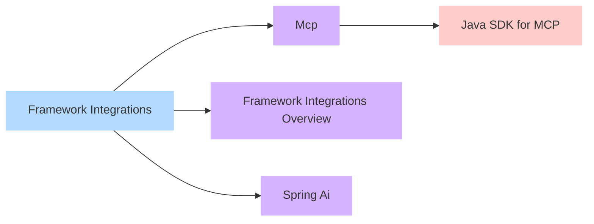

<!-- AUTO-GENERATED FILE — DO NOT EDIT. Regenerated on merge -->

### Framework Integrations

<em>Click any block below to navigate directly to that section.</em>

```mermaid
graph LR
n_50_framework_integrations["Framework Integrations"]
n_50_framework_integrations_mcp["Mcp"]
n_50_framework_integrations --> n_50_framework_integrations_mcp
n_50_framework_integrations_mcp_java_mcp_sdk_md["Java SDK for MCP"]
n_50_framework_integrations_mcp --> n_50_framework_integrations_mcp_java_mcp_sdk_md
n_50_framework_integrations_overview_md["Framework Integrations Overview"]
n_50_framework_integrations --> n_50_framework_integrations_overview_md
n_50_framework_integrations_spring_ai["Spring Ai"]
n_50_framework_integrations --> n_50_framework_integrations_spring_ai
click n_50_framework_integrations "/docs/framework-integrations"
click n_50_framework_integrations_mcp "/docs/framework-integrations/mcp"
click n_50_framework_integrations_mcp_java_mcp_sdk_md "/docs/framework-integrations/mcp/java-mcp-sdk"
click n_50_framework_integrations_overview_md "/docs/framework-integrations/overview"
click n_50_framework_integrations_spring_ai "/docs/framework-integrations/spring-ai"
classDef col0 fill:#b3d9ff,stroke:none;
classDef col1 fill:#d5b3ff,stroke:none;
classDef col2 fill:#ffcccc,stroke:none;
classDef col3 fill:#ffd699,stroke:none;
classDef col4 fill:#d0f0c0,stroke:none;
class n_50_framework_integrations_mcp_java_mcp_sdk_md col2;
class n_50_framework_integrations_mcp col1;
class n_50_framework_integrations_overview_md col1;
class n_50_framework_integrations_spring_ai col1;
class n_50_framework_integrations col0;
linkStyle default interpolate basis
```