<!-- AUTO-GENERATED FILE — DO NOT EDIT. Regenerated on merge -->

### Welcome

```mermaid
graph LR
root["Docs"]
full_sitemap_md["Full Site Map"]
root --> full_sitemap_md
n_00_getting_started["Getting Started"]
root --> n_00_getting_started
n_00_getting_started_05_new_to_java["New To Java"]
n_00_getting_started --> n_00_getting_started_05_new_to_java
n_00_getting_started_what_is_ai_md["🧭 What is AI?"]
n_00_getting_started --> n_00_getting_started_what_is_ai_md
n_10_machine_learning["Machine Learning"]
root --> n_10_machine_learning
n_10_machine_learning_machine_learning["Machine Learning"]
n_10_machine_learning --> n_10_machine_learning_machine_learning
n_20_generative_ai["Generative Ai"]
root --> n_20_generative_ai
n_20_generative_ai_50_framework_integrations["Framework Integrations"]
n_20_generative_ai --> n_20_generative_ai_50_framework_integrations
n_20_generative_ai_inference["Inference"]
n_20_generative_ai --> n_20_generative_ai_inference
n_30_agentic_ai["Agentic Ai"]
root --> n_30_agentic_ai
n_30_agentic_ai_20_agent_frameworks["Agent Frameworks"]
n_30_agentic_ai --> n_30_agentic_ai_20_agent_frameworks
n_40_ai_for_code["Ai For Code"]
root --> n_40_ai_for_code
click full_sitemap_md "/docs/full-sitemap"
click n_00_getting_started "/docs/getting-started"
click n_00_getting_started_05_new_to_java "/docs/getting-started/new-to-java"
click n_00_getting_started_what_is_ai_md "/docs/getting-started/what-is-ai"
click n_10_machine_learning "/docs/machine-learning"
click n_10_machine_learning_machine_learning "/docs/machine-learning/machine-learning"
click n_20_generative_ai "/docs/generative-ai"
click n_20_generative_ai_50_framework_integrations "/docs/generative-ai/framework-integrations"
click n_20_generative_ai_inference "/docs/generative-ai/inference"
click n_30_agentic_ai "/docs/agentic-ai"
click n_30_agentic_ai_20_agent_frameworks "/docs/agentic-ai/agent-frameworks"
click n_40_ai_for_code "/docs/ai-for-code"
classDef col0 fill:#b3d9ff,stroke:none;
classDef col1 fill:#d5b3ff,stroke:none;
classDef col2 fill:#ffcccc,stroke:none;
class n_00_getting_started_05_new_to_java col2;
class n_00_getting_started col1;
class n_10_machine_learning_machine_learning col2;
class n_10_machine_learning col1;
class n_20_generative_ai_50_framework_integrations col2;
class n_20_generative_ai_inference col2;
class n_20_generative_ai col1;
class n_30_agentic_ai_20_agent_frameworks col2;
class n_30_agentic_ai col1;
class n_40_ai_for_code col1;
class root col0;
classDef custom0 fill:#d5b3ff;
class full_sitemap_md custom0;
classDef custom1 fill:#ffcccc,stroke:green,stroke-width:4px,stroke-dasharray:0;
class n_00_getting_started_what_is_ai_md custom1;
linkStyle default interpolate basis
```

<small>Here's an overview of the first layers of this resource. Simply click on the boxes to get directly to your article of choice, or use the sidebar to navigate.</small>

<small><strong>Legend:</strong> **💻** type:code | **🙌** type:tutorial | **📊** type:benchmark | **📚** type:api-doc | **🧭** type:overview | **🔗** type:external | **border:🟢** level:beginner | **border:🟡** level:intermediate | **border:🟠** level:advanced | **border:🔴** level:expert | **bg:⬤** status:draft | **bg:⬤** status:wip | **bg:⬤** status:review-needed | **bg:⬤** status:planned | **•** visibility:internal | **•** visibility:archived</small>