<!-- AUTO-GENERATED FILE — DO NOT EDIT. Regenerated on merge -->

---
sidebar_position: 1
---

# Tutorial Intro

Let's discover **Docusaurus in less than 5 minutes**.

## Getting Started

Get started by **creating a new site**.

Or **try Docusaurus immediately** with **[docusaurus.new](https://docusaurus.new)**.

### What you'll need

- [Node.js](https://nodejs.org/en/download/) version 18.0 or above:
  - When installing Node.js, you are recommended to check all checkboxes related to dependencies.

## Generate a new site

Generate a new Docusaurus site using the **classic template**.

The classic template will automatically be added to your project after you run the command:

```bash
npm init docusaurus@latest my-website classic
```

You can type this command into Command Prompt, Powershell, Terminal, or any other integrated terminal of your code editor.

The command also installs all necessary dependencies you need to run Docusaurus.

## Start your site

Run the development server:

```bash
cd my-website
npm run start
```

The `cd` command changes the directory you're working with. In order to work with your newly created Docusaurus site, you'll need to navigate the terminal there.

The `npm run start` command builds your website locally and serves it through a development server, ready for you to view at http://localhost:3000/.

Open `docs/intro.md` (this page) and edit some lines: the site **reloads automatically** and displays your changes.

### Docs

```mermaid
graph LR
root["Docs"]
_template_md["REQUIRED TAGS — fill all:"]
root --> _template_md
n_00_getting_started["Getting Started"]
root --> n_00_getting_started
n_00_getting_started_how_to_contribute_md["How to Contribute"]
n_00_getting_started --> n_00_getting_started_how_to_contribute_md
n_00_getting_started_roles_and_paths_md["Roles and Paths"]
n_00_getting_started --> n_00_getting_started_roles_and_paths_md
n_00_getting_started_what_is_java_ai_md["What is Java + AI?"]
n_00_getting_started --> n_00_getting_started_what_is_java_ai_md
n_10_foundations["Foundations"]
root --> n_10_foundations
n_10_foundations_inference["Inference"]
n_10_foundations --> n_10_foundations_inference
n_10_foundations_inference_jlama_md["Jlama"]
n_10_foundations_inference --> n_10_foundations_inference_jlama_md
n_10_foundations_inference_llama3_java_md["llama3.java"]
n_10_foundations_inference --> n_10_foundations_inference_llama3_java_md
n_10_foundations_inference_overview_md["Inference Overview"]
n_10_foundations_inference --> n_10_foundations_inference_overview_md
n_10_foundations_machine_learning["Machine Learning"]
n_10_foundations --> n_10_foundations_machine_learning
n_10_foundations_machine_learning_deepnets["Deepnets"]
n_10_foundations_machine_learning --> n_10_foundations_machine_learning_deepnets
n_10_foundations_machine_learning_deepnets_deeplearning4j_md["Deeplearning4j"]
n_10_foundations_machine_learning_deepnets --> n_10_foundations_machine_learning_deepnets_deeplearning4j_md
n_10_foundations_machine_learning_nlp["Nlp"]
n_10_foundations_machine_learning --> n_10_foundations_machine_learning_nlp
n_10_foundations_machine_learning_nlp_opennlp_md["OpenNLP"]
n_10_foundations_machine_learning_nlp --> n_10_foundations_machine_learning_nlp_opennlp_md
n_10_foundations_machine_learning_overview_md["ML Overview"]
n_10_foundations_machine_learning --> n_10_foundations_machine_learning_overview_md
n_20_agent_frameworks["Agent Frameworks"]
root --> n_20_agent_frameworks
n_20_agent_frameworks_adk["Adk"]
n_20_agent_frameworks --> n_20_agent_frameworks_adk
n_20_agent_frameworks_adk_adk_fsm_overview_md["adk-fsm-overview"]
n_20_agent_frameworks_adk --> n_20_agent_frameworks_adk_adk_fsm_overview_md
n_20_agent_frameworks_adk_agent_benchmarking_md["agent-benchmarking"]
n_20_agent_frameworks_adk --> n_20_agent_frameworks_adk_agent_benchmarking_md
n_20_agent_frameworks_adk_agent_charts_md["🙌 agent-charts"]
n_20_agent_frameworks_adk --> n_20_agent_frameworks_adk_agent_charts_md
n_20_agent_frameworks_adk_agent_init_md["agent-init"]
n_20_agent_frameworks_adk --> n_20_agent_frameworks_adk_agent_init_md
n_20_agent_frameworks_adk_external_link_agent_sdk_md["<a href='https://google.github.io/adk-docs/' target='_blank' rel='noopener noreferrer'>external-link-agent-sdk 🔗</a>"]
n_20_agent_frameworks_adk --> n_20_agent_frameworks_adk_external_link_agent_sdk_md
n_20_agent_frameworks_adk_external_tutorial_dev_to_md["<a href='https://www.datacamp.com/tutorial/agent-development-kit-adk' target='_blank' rel='noopener noreferrer'>external-tutorial-dev-to 🔗</a>"]
n_20_agent_frameworks_adk --> n_20_agent_frameworks_adk_external_tutorial_dev_to_md
n_20_agent_frameworks_adk_intro_md["intro"]
n_20_agent_frameworks_adk --> n_20_agent_frameworks_adk_intro_md
n_20_agent_frameworks_langchain4j["Langchain4J"]
n_20_agent_frameworks --> n_20_agent_frameworks_langchain4j
n_20_agent_frameworks_langgraph4j["Langgraph4J"]
n_20_agent_frameworks --> n_20_agent_frameworks_langgraph4j
n_20_agent_frameworks_langgraph4j_status_todo_md["TODO: LangGraph4j by @vorburger"]
n_20_agent_frameworks_langgraph4j --> n_20_agent_frameworks_langgraph4j_status_todo_md
n_20_agent_frameworks_overview_md["Agent Frameworks Overview"]
n_20_agent_frameworks --> n_20_agent_frameworks_overview_md
n_30_java_ai_workflows["Java Ai Workflows"]
root --> n_30_java_ai_workflows
n_30_java_ai_workflows_generic_java["Generic Java"]
n_30_java_ai_workflows --> n_30_java_ai_workflows_generic_java
n_30_java_ai_workflows_generic_java_java_ai_workflow_md["Java AI Workflow"]
n_30_java_ai_workflows_generic_java --> n_30_java_ai_workflows_generic_java_java_ai_workflow_md
n_30_java_ai_workflows_kotlin_based["Kotlin Based"]
n_30_java_ai_workflows --> n_30_java_ai_workflows_kotlin_based
n_30_java_ai_workflows_kotlin_based_embabel_md["Embabel (Kotlin)"]
n_30_java_ai_workflows_kotlin_based --> n_30_java_ai_workflows_kotlin_based_embabel_md
n_30_java_ai_workflows_kotlin_based_koog_md["Koog (Kotlin)"]
n_30_java_ai_workflows_kotlin_based --> n_30_java_ai_workflows_kotlin_based_koog_md
n_30_java_ai_workflows_overview_md["Workflows Overview"]
n_30_java_ai_workflows --> n_30_java_ai_workflows_overview_md
n_40_a2a_ecosystem["A2A Ecosystem"]
root --> n_40_a2a_ecosystem
n_40_a2a_ecosystem_java_a2a_sdk_md["Java A2A SDK"]
n_40_a2a_ecosystem --> n_40_a2a_ecosystem_java_a2a_sdk_md
n_40_a2a_ecosystem_overview_md["A2A Overview"]
n_40_a2a_ecosystem --> n_40_a2a_ecosystem_overview_md
n_40_a2a_ecosystem_status_todo_md["TODO: A2A Work by @vorburger"]
n_40_a2a_ecosystem --> n_40_a2a_ecosystem_status_todo_md
n_50_framework_integrations["Framework Integrations"]
root --> n_50_framework_integrations
n_50_framework_integrations_mcp["Mcp"]
n_50_framework_integrations --> n_50_framework_integrations_mcp
n_50_framework_integrations_mcp_java_mcp_sdk_md["Java SDK for MCP"]
n_50_framework_integrations_mcp --> n_50_framework_integrations_mcp_java_mcp_sdk_md
n_50_framework_integrations_overview_md["Framework Integrations Overview"]
n_50_framework_integrations --> n_50_framework_integrations_overview_md
n_50_framework_integrations_spring_ai["Spring Ai"]
n_50_framework_integrations --> n_50_framework_integrations_spring_ai
n_99_todo["Todo"]
root --> n_99_todo
n_99_todo_placeholders_md["TODO Placeholder Docs"]
n_99_todo --> n_99_todo_placeholders_md
intro_md["Tutorial Intro"]
root --> intro_md
tutorial_basics["Tutorial Basics"]
root --> tutorial_basics
tutorial_basics_congratulations_md["Congratulations!"]
tutorial_basics --> tutorial_basics_congratulations_md
tutorial_basics_create_a_blog_post_md["Create a Blog Post"]
tutorial_basics --> tutorial_basics_create_a_blog_post_md
tutorial_basics_create_a_document_md["Create a Document"]
tutorial_basics --> tutorial_basics_create_a_document_md
tutorial_basics_create_a_page_md["Create a Page"]
tutorial_basics --> tutorial_basics_create_a_page_md
tutorial_basics_deploy_your_site_md["Deploy your site"]
tutorial_basics --> tutorial_basics_deploy_your_site_md
tutorial_extras["Tutorial Extras"]
root --> tutorial_extras
tutorial_extras_img["Img"]
tutorial_extras --> tutorial_extras_img
tutorial_extras_manage_docs_versions_md["Manage Docs Versions"]
tutorial_extras --> tutorial_extras_manage_docs_versions_md
tutorial_extras_translate_your_site_md["Translate your site"]
tutorial_extras --> tutorial_extras_translate_your_site_md
click _template_md "/docs/.template"
click n_00_getting_started "/docs/getting-started"
click n_00_getting_started_how_to_contribute_md "/docs/getting-started/how-to-contribute"
click n_00_getting_started_roles_and_paths_md "/docs/getting-started/roles-and-paths"
click n_00_getting_started_what_is_java_ai_md "/docs/getting-started/what-is-java-ai"
click n_10_foundations "/docs/foundations"
click n_10_foundations_inference "/docs/foundations/inference"
click n_10_foundations_inference_jlama_md "/docs/foundations/inference/jlama"
click n_10_foundations_inference_llama3_java_md "/docs/foundations/inference/llama3-java"
click n_10_foundations_inference_overview_md "/docs/foundations/inference/overview"
click n_10_foundations_machine_learning "/docs/foundations/machine-learning"
click n_10_foundations_machine_learning_deepnets "/docs/foundations/machine-learning/deepnets"
click n_10_foundations_machine_learning_deepnets_deeplearning4j_md "/docs/foundations/machine-learning/deepnets/deeplearning4j"
click n_10_foundations_machine_learning_nlp "/docs/foundations/machine-learning/nlp"
click n_10_foundations_machine_learning_nlp_opennlp_md "/docs/foundations/machine-learning/nlp/opennlp"
click n_10_foundations_machine_learning_overview_md "/docs/foundations/machine-learning/overview"
click n_20_agent_frameworks "/docs/agent-frameworks"
click n_20_agent_frameworks_adk "/docs/agent-frameworks/adk"
click n_20_agent_frameworks_adk_adk_fsm_overview_md "/docs/agent-frameworks/adk/adk-fsm-overview"
click n_20_agent_frameworks_adk_agent_benchmarking_md "/docs/agent-frameworks/adk/agent-benchmarking"
click n_20_agent_frameworks_adk_agent_charts_md "/docs/agent-frameworks/adk/agent-charts"
click n_20_agent_frameworks_adk_agent_init_md "/docs/agent-frameworks/adk/agent-init"
click n_20_agent_frameworks_adk_intro_md "/docs/agent-frameworks/adk/intro"
click n_20_agent_frameworks_langchain4j "/docs/agent-frameworks/langchain4j"
click n_20_agent_frameworks_langgraph4j "/docs/agent-frameworks/langgraph4j"
click n_20_agent_frameworks_langgraph4j_status_todo_md "/docs/agent-frameworks/langgraph4j/status-todo"
click n_20_agent_frameworks_overview_md "/docs/agent-frameworks/overview"
click n_30_java_ai_workflows "/docs/java-ai-workflows"
click n_30_java_ai_workflows_generic_java "/docs/java-ai-workflows/generic-java"
click n_30_java_ai_workflows_generic_java_java_ai_workflow_md "/docs/java-ai-workflows/generic-java/java-ai-workflow"
click n_30_java_ai_workflows_kotlin_based "/docs/java-ai-workflows/kotlin-based"
click n_30_java_ai_workflows_kotlin_based_embabel_md "/docs/java-ai-workflows/kotlin-based/embabel"
click n_30_java_ai_workflows_kotlin_based_koog_md "/docs/java-ai-workflows/kotlin-based/koog"
click n_30_java_ai_workflows_overview_md "/docs/java-ai-workflows/overview"
click n_40_a2a_ecosystem "/docs/a2a-ecosystem"
click n_40_a2a_ecosystem_java_a2a_sdk_md "/docs/a2a-ecosystem/java-a2a-sdk"
click n_40_a2a_ecosystem_overview_md "/docs/a2a-ecosystem/overview"
click n_40_a2a_ecosystem_status_todo_md "/docs/a2a-ecosystem/status-todo"
click n_50_framework_integrations "/docs/framework-integrations"
click n_50_framework_integrations_mcp "/docs/framework-integrations/mcp"
click n_50_framework_integrations_mcp_java_mcp_sdk_md "/docs/framework-integrations/mcp/java-mcp-sdk"
click n_50_framework_integrations_overview_md "/docs/framework-integrations/overview"
click n_50_framework_integrations_spring_ai "/docs/framework-integrations/spring-ai"
click n_99_todo "/docs/todo"
click n_99_todo_placeholders_md "/docs/todo/placeholders"
click intro_md "/docs/intro"
click tutorial_basics "/docs/tutorial-basics"
click tutorial_basics_congratulations_md "/docs/tutorial-basics/congratulations"
click tutorial_basics_create_a_blog_post_md "/docs/tutorial-basics/create-a-blog-post"
click tutorial_basics_create_a_document_md "/docs/tutorial-basics/create-a-document"
click tutorial_basics_create_a_page_md "/docs/tutorial-basics/create-a-page"
click tutorial_basics_deploy_your_site_md "/docs/tutorial-basics/deploy-your-site"
click tutorial_extras "/docs/tutorial-extras"
click tutorial_extras_img "/docs/tutorial-extras/img"
click tutorial_extras_manage_docs_versions_md "/docs/tutorial-extras/manage-docs-versions"
click tutorial_extras_translate_your_site_md "/docs/tutorial-extras/translate-your-site"
classDef col0 fill:#b3d9ff,stroke:none;
classDef col1 fill:#d5b3ff,stroke:none;
classDef col2 fill:#ffcccc,stroke:none;
classDef col3 fill:#ffd699,stroke:none;
classDef col4 fill:#d0f0c0,stroke:none;
class _template_md col1;
class n_00_getting_started_how_to_contribute_md col2;
class n_00_getting_started_roles_and_paths_md col2;
class n_00_getting_started_what_is_java_ai_md col2;
class n_00_getting_started col1;
class n_10_foundations_inference_jlama_md col3;
class n_10_foundations_inference_llama3_java_md col3;
class n_10_foundations_inference_overview_md col3;
class n_10_foundations_inference col2;
class n_10_foundations_machine_learning_deepnets_deeplearning4j_md col4;
class n_10_foundations_machine_learning_deepnets col3;
class n_10_foundations_machine_learning_nlp_opennlp_md col4;
class n_10_foundations_machine_learning_nlp col3;
class n_10_foundations_machine_learning_overview_md col3;
class n_10_foundations_machine_learning col2;
class n_10_foundations col1;
class n_20_agent_frameworks_adk_external_link_agent_sdk_md col3;
class n_20_agent_frameworks_adk_intro_md col3;
class n_20_agent_frameworks_adk col2;
class n_20_agent_frameworks_langchain4j col2;
class n_20_agent_frameworks_langgraph4j_status_todo_md col3;
class n_20_agent_frameworks_langgraph4j col2;
class n_20_agent_frameworks_overview_md col2;
class n_20_agent_frameworks col1;
class n_30_java_ai_workflows_generic_java_java_ai_workflow_md col3;
class n_30_java_ai_workflows_generic_java col2;
class n_30_java_ai_workflows_kotlin_based_embabel_md col3;
class n_30_java_ai_workflows_kotlin_based_koog_md col3;
class n_30_java_ai_workflows_kotlin_based col2;
class n_30_java_ai_workflows_overview_md col2;
class n_30_java_ai_workflows col1;
class n_40_a2a_ecosystem_java_a2a_sdk_md col2;
class n_40_a2a_ecosystem_overview_md col2;
class n_40_a2a_ecosystem_status_todo_md col2;
class n_40_a2a_ecosystem col1;
class n_50_framework_integrations_mcp_java_mcp_sdk_md col3;
class n_50_framework_integrations_mcp col2;
class n_50_framework_integrations_overview_md col2;
class n_50_framework_integrations_spring_ai col2;
class n_50_framework_integrations col1;
class n_99_todo_placeholders_md col2;
class n_99_todo col1;
class intro_md col1;
class tutorial_basics_congratulations_md col2;
class tutorial_basics_create_a_blog_post_md col2;
class tutorial_basics_create_a_document_md col2;
class tutorial_basics_create_a_page_md col2;
class tutorial_basics_deploy_your_site_md col2;
class tutorial_basics col1;
class tutorial_extras_img col2;
class tutorial_extras_manage_docs_versions_md col2;
class tutorial_extras_translate_your_site_md col2;
class tutorial_extras col1;
class root col0;
classDef custom0 stroke:yellow,stroke-width:2px,stroke-dasharray:0;
class n_20_agent_frameworks_adk_adk_fsm_overview_md custom0;
classDef custom1 fill:lightgrey,stroke:orange,stroke-width:2px,stroke-dasharray:0;
class n_20_agent_frameworks_adk_agent_benchmarking_md custom1;
classDef custom2 stroke:yellow,stroke-width:2px,stroke-dasharray:0;
class n_20_agent_frameworks_adk_agent_charts_md custom2;
classDef custom3 stroke:green,stroke-width:2px,stroke-dasharray:0;
class n_20_agent_frameworks_adk_agent_init_md custom3;
classDef custom4 stroke:green,stroke-width:2px,stroke-dasharray:0;
class n_20_agent_frameworks_adk_external_tutorial_dev_to_md custom4;
linkStyle default interpolate basis
```

<p class="margin-top-negative"><em>Click any block below to navigate directly to that section.</em></p>



<small><strong>Legend:</strong> **💻** type:code | **🙌** type:tutorial | **📊** type:benchmark | **📚** type:api-doc | **🧭** type:overview | **border:🟢** level:beginner | **border:🟡** level:intermediate | **border:🟠** level:advanced | **border:🔴** level:expert | **bg:⬤** status:draft | **bg:⬤** status:wip | **bg:⬤** status:review-needed | **bg:⬤** status:planned | **•** visibility:internal | **•** visibility:archived</small>